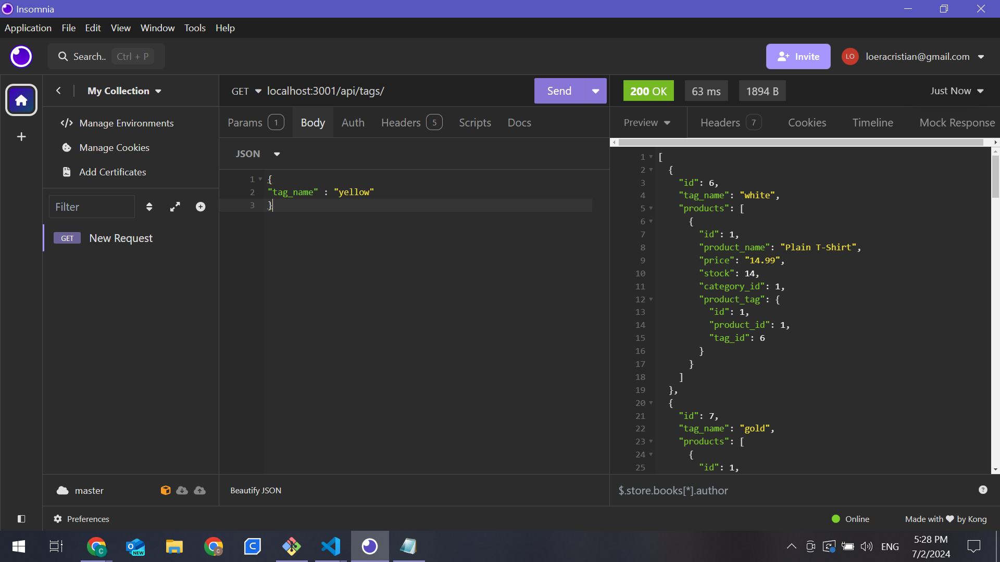
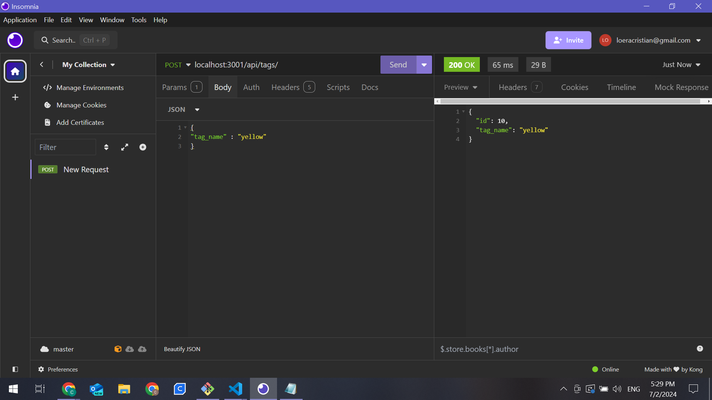

  # Back-end and Routes  

  ## Description 
  ```md
  This is a Node.js and Express project. Where we need to practice the most used routes, POST, DELETE, PUT, and GET. 

  ```
  ## Table of Contents 
  - [Installation](#installation)
  - [Usage](#usage)
  - [Contributing](#contributing)
  - [Test](#test)
  - [License](#license)
  - [Questions](#questions)

  ## Installation 
```md
After running your database.
On the console, run the following:
- npm i
- npm run seed
- npm start

And on Thunderclient or Insomnia, run the tests
```

  ## Usage
 ```md
With this project you can succesfully create, update, and delete data from the data base.
```



  ## Credits
```md
Cristian Loera
```
  ## Test
  ```md
  npm i, npm run seed, npm start
```


  ## License
  None
  

  ## Questions
  If you have any questions about the repository, contact me in [el-bicho7](https://github.com/el-bicho7) and @ loera_73@hotmail.com
 
  